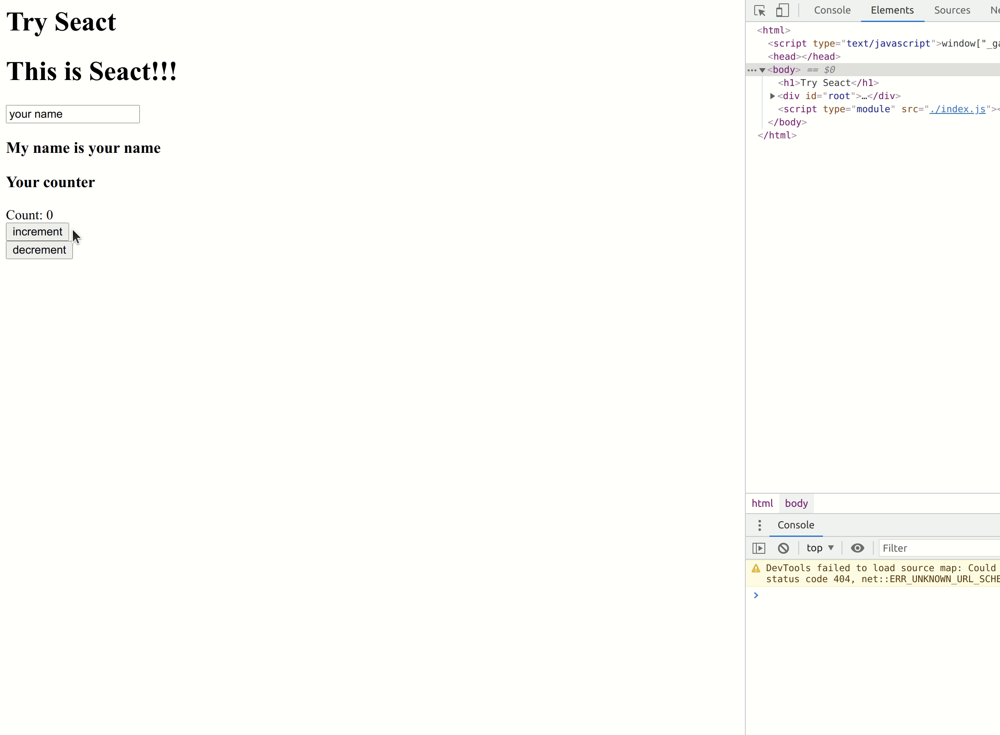

## seact

sasurau4's React -> Seact

See https://pomb.us/build-your-own-react/

### Requirement

- python3
- Nodejs

### Getting Started

```
yarn
yarn watch
yarn start
```

Open http://localhost:8000

### Screenshot

